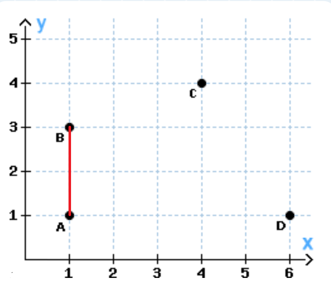

# ScalaCalcPoints
The Scala Programm calculates the minimum distance of points.

Sample Coordinates: 

Minimum distance of all points = 2.0

## Build
sbt clean compile

sbt ~compile

sbt test

sbt testQuick

sbt ~testQuick

## Run
sbt run

Output:

Start App...

Minimum distance of all points = 2.0
